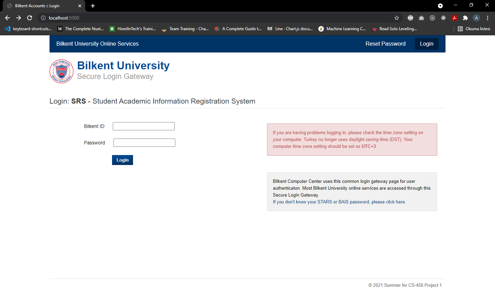

# CS-458-Project-1 Test Automation with Selenium
Shared code repository for CS-458 Project 1



The website can be found live [here](https://srs-login-page.herokuapp.com/)

or

Start it on your own device using the following commands:
```
npm install
node app.js
```


Accepted users:

- ID: "12345", Password: "pass12345"
- ID: "20212021", Password: "pass2021"
- ID: "27", Password: "admin27"

The tests are located in the SeleniumJavaTest folder which is an intellij Java project folder.

Our tests reside in SeleniumPlain.java and we used User.java to hold user information.

You can specifiy the URL to use with the first parameter of the test functions.

To execute the test you must download the web drivers for Chrome, Firefox and Opera as well as their corresponding browsers.
